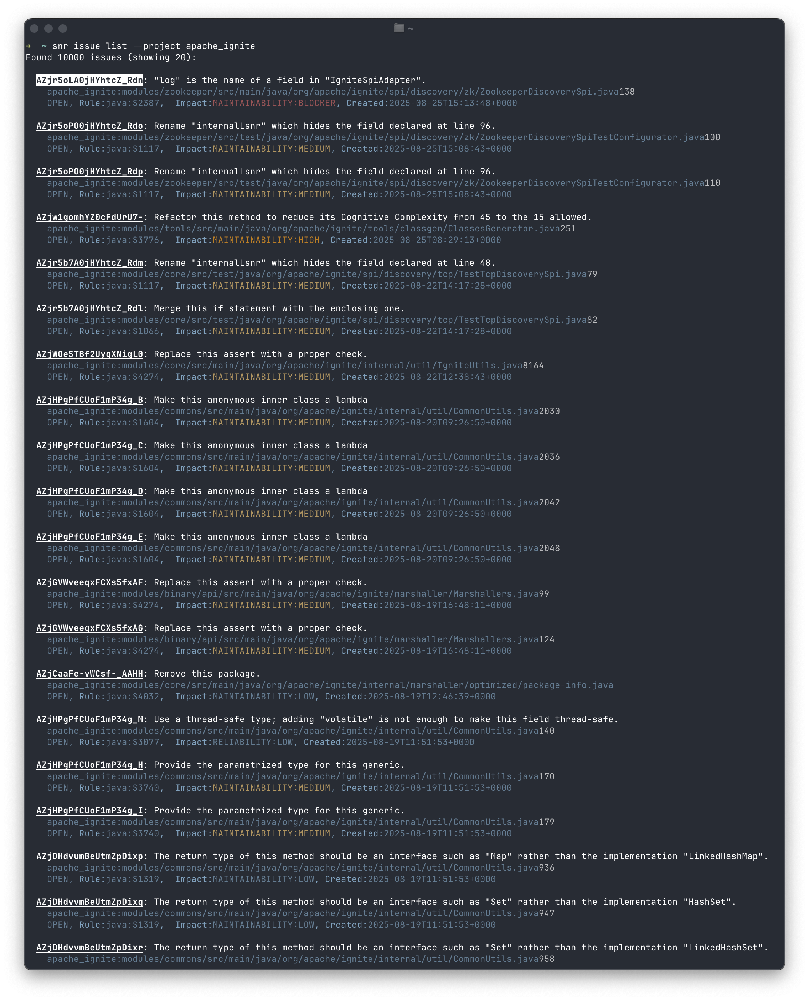
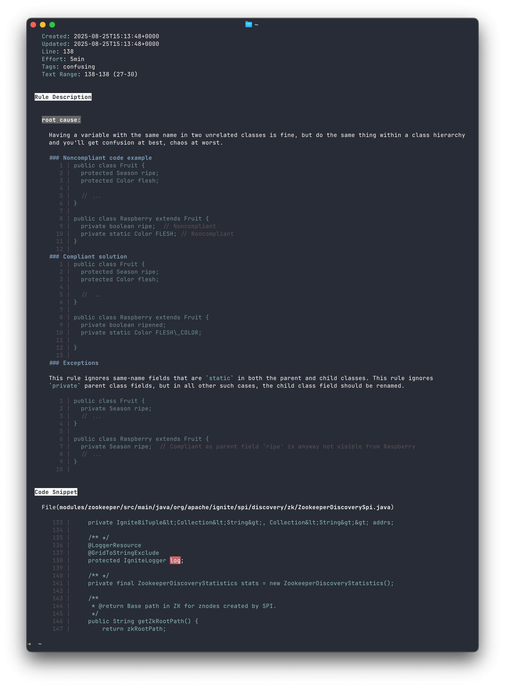
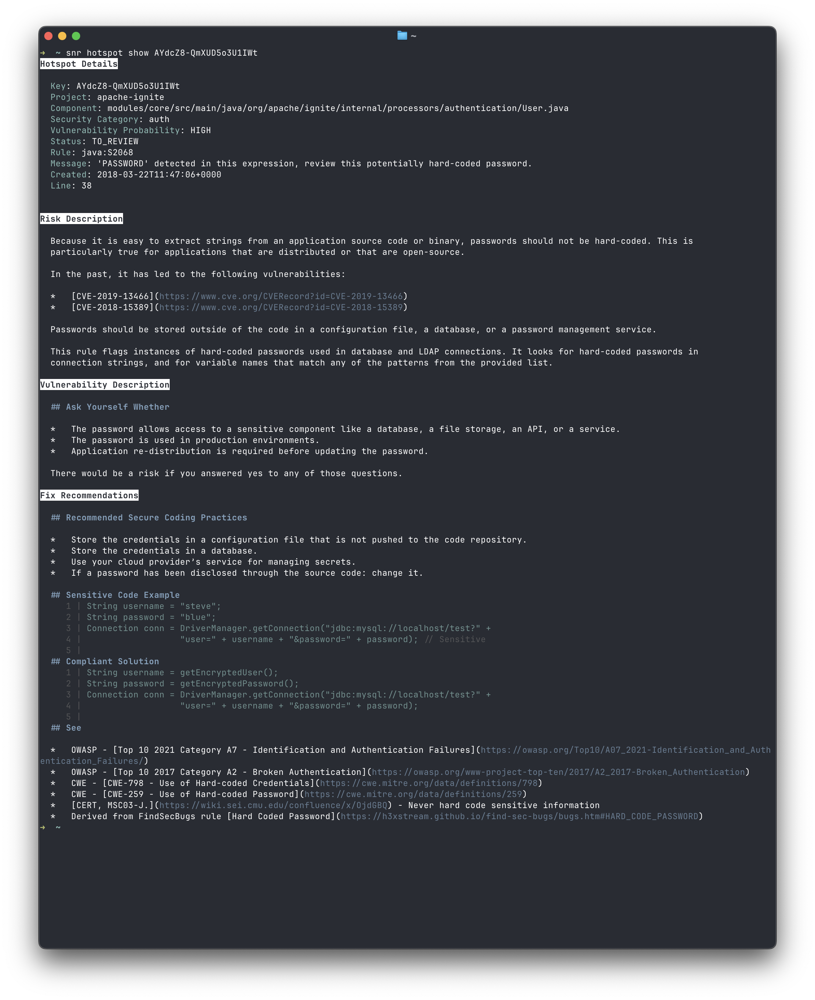

# SonarQube CLI

[](https://sonarcloud.io/summary/new_code?id=sonarqube-cli) [](https://sonarcloud.io/summary/new_code?id=sonarqube-cli) [](https://sonarcloud.io/summary/new_code?id=sonarqube-cli) [](https://sonarcloud.io/summary/new_code?id=sonarqube-cli)

Command line interface for SonarQube Server and SonarQube Cloud.

## Installation

- `npm install -g sonarqube-cli`
- The `snr` command should now be installed.

| List issues                                  | Show Issue Details                                  | Show hotspot details                                    |
| -------------------------------------------- | --------------------------------------------------- | ------------------------------------------------------- |
|  |  |  |

## Configuration and Usage

`snr` can be configured according to the table below.

- command-line args are highest priority
- next, if there's a `sonar-project.properties` somewhere up your working directory tree, it will be used.
- env variables are checked last.

| Env Variable     | `sonar-project.properties` | Command Line     |
| ---------------- | -------------------------- | ---------------- |
| `SONAR_TOKEN`    | `sonar.token`              | none             |
| `SONAR_HOST_URL` | `sonar.host.url`           | `--base-url`     |
| n/a              | `sonar.projectKey`         | `--project`      |
| n/a              | `sonar.organization`       | `--organization` |

## Useful features

```
CLI for SonarQube Server & Cloud API

Options:
  -V, --version     output the version number
  --base-url <url>  SonarQube server base URL
  --dry-run         Show what would be done, without making any changes
  -h, --help        display help for command

Commands:
  issue             Search and review issues
  hotspot           Search and review security hotspots
  project           Show SonarQube projects
  status            Check system status
  risk              Search and review dependency risks
  help [command]    display help for command

Examples:
  snr issue list --project my-project --severity HIGH
  snr hotspot show AZjzzVD1Xsy7a47AllAl
  snr project list --favorites
  snr risk list --project my-project --severity HIGH CRITICAL
```

- 💻 use the `--json` flag to output JSON
- 📡 use `--dry-run` to output a CURL command instead of sending a real request.
- 🤖 use `--fix` (where supported) to pass issue details to a local AI tool like Claude Code.

## Development

```bash
yarn install
yarn dev          # Run CLI in development
yarn build        # Build for production
yarn lint         # Lint code
yarn format       # Format code
yarn typecheck    # Type check
yarn validate     # Run everything
```

## Contributing and Feature Requests

Contributions are welcome. Please log an issue if you'd like to request support for a particular API.
